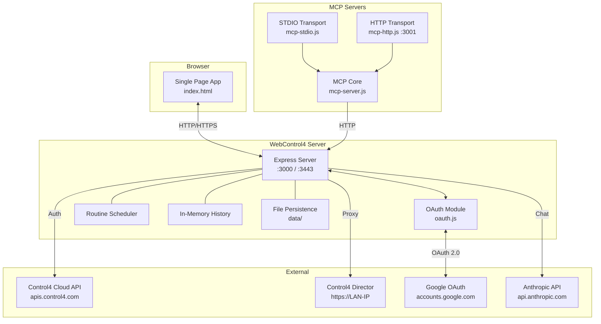
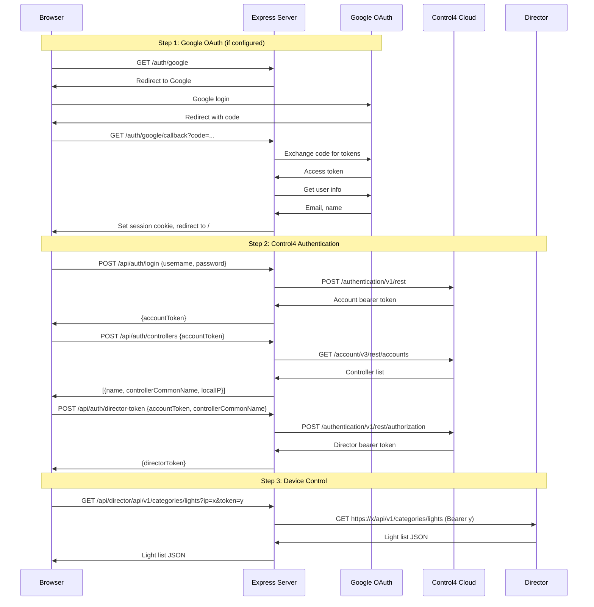
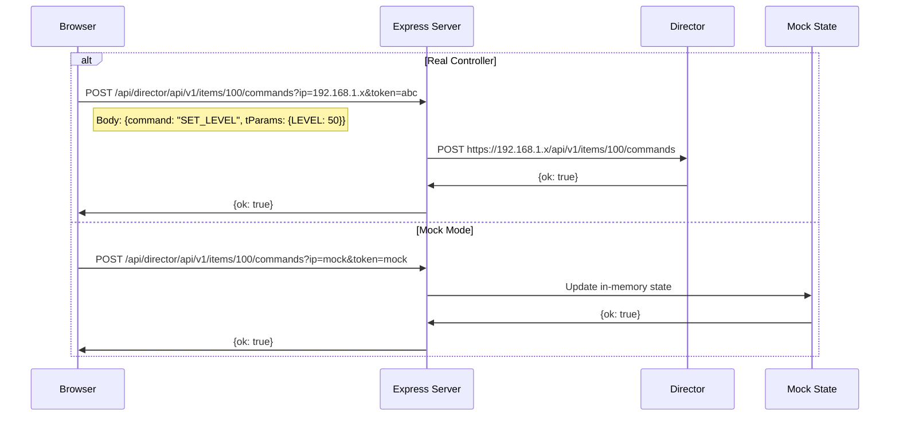
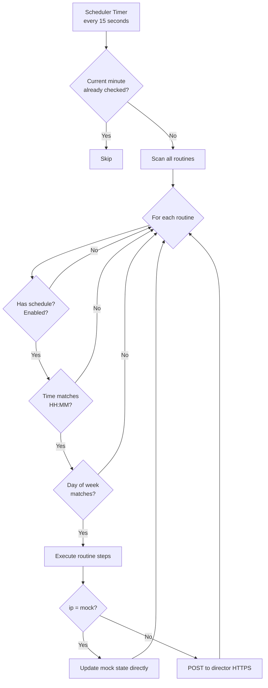
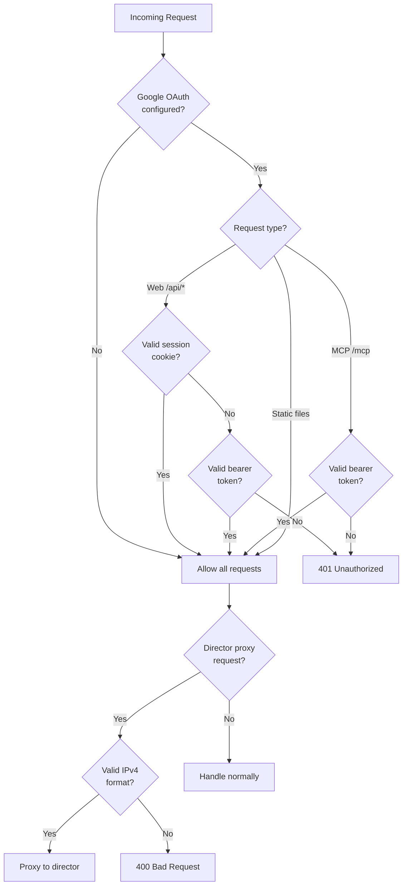

# WebControl4 — Design Documentation

This document describes the architecture, modules, data flow, and APIs of WebControl4 for contributors.

---

## Architecture Overview

WebControl4 is a Node.js/Express application that serves a single-page web app and proxies requests to a Control4 director on the local network. It also exposes an MCP (Model Context Protocol) server for AI assistant integration.



---

## Module Descriptions

### `server.js` — Main Express Server

The central module. Responsibilities:
- Serves the static SPA (`public/index.html`)
- Proxies GET/POST/PUT requests to the Control4 director
- Handles Control4 cloud authentication (login, controller list, director token)
- Manages mock controller state for demo mode
- Provides history recording and querying endpoints
- Runs the routine scheduler
- Forwards LLM chat requests to Anthropic

### `oauth.js` — Authentication Module

In-memory OAuth and session management:
- Google OAuth flow (authorization URL, code exchange, user info)
- Web session management (cookies, TTL-based expiry)
- MCP OAuth 2.0 Authorization Server (RFC 7591 dynamic client registration, PKCE)
- Bearer token validation for MCP access

### `mcp-server.js` — MCP Core

Defines all MCP tools using the `@modelcontextprotocol/sdk`. Shared by both transports:
- 6 read tools: `list_lights`, `list_thermostats`, `list_scenes`, `list_routines`, `get_device_history`, `get_floor_activity`
- 7 control tools: `set_light_level`, `set_thermostat_mode`, `set_heat_setpoint`, `set_cool_setpoint`, `activate_scene`, `execute_routine`, `create_routine`

### `mcp-stdio.js` — STDIO Transport

Entry point for Claude Desktop integration. Connects MCP core to STDIO transport. Auto-authenticates in demo mode.

### `mcp-http.js` — HTTP Transport

Standalone Express server (port 3001) for remote AI clients. Includes:
- OAuth 2.0 Authorization Server endpoints
- Stateless MCP endpoint (`POST /mcp`)

### `http-client.js` — HTTP Client Utilities

Shared HTTP request helpers:
- `requestText()` — low-level HTTP/HTTPS with redirect following and credential stripping on cross-origin redirects
- `requestJson()` — JSON wrapper with error handling
- `isPrivateOrLocalHost()` — TLS verification is only skipped for private IPs

### `public/index.html` — Single Page App

Complete frontend in a single HTML file:
- CSS custom properties for theming
- View management (login → controller selection → dashboard)
- Four dashboard tabs: devices, history (Chart.js), AI assistant, settings
- Routine editor modal with schedule configuration

---

## Data Flow

### Authentication Flow



### Device Command Flow



### Routine Scheduling Flow



---

## Data Model

### Routine

```json
{
  "id": "550e8400-e29b-41d4-a716-446655440000",
  "name": "Good Night",
  "steps": [
    {
      "type": "light_level",
      "deviceId": 100,
      "deviceName": "Kitchen Ceiling",
      "level": 0
    },
    {
      "type": "hvac_mode",
      "deviceId": 500,
      "deviceName": "Main Floor Thermostat",
      "mode": "Auto"
    }
  ],
  "schedule": {
    "enabled": true,
    "time": "22:00",
    "days": [0, 1, 2, 3, 4, 5, 6]
  }
}
```

**Step types:**

| Type | Fields | Description |
|------|--------|-------------|
| `light_level` | `deviceId`, `level` (0–100) | Set brightness |
| `light_toggle` | `deviceId`, `on` (boolean) | Turn on/off |
| `hvac_mode` | `deviceId`, `mode` (Off/Heat/Cool/Auto) | Set HVAC mode |
| `heat_setpoint` | `deviceId`, `value` (°F) | Set heat target |
| `cool_setpoint` | `deviceId`, `value` (°F) | Set cool target |

### History Point (in-memory)

```json
// Light: key = "light:{id}"
{ "ts": 1709901234567, "on": true, "level": 80 }

// Thermostat: key = "thermo:{id}"
{ "ts": 1709901234567, "tempF": 72, "heatF": 68, "coolF": 74, "hvacMode": "Auto" }

// Floor: key = "floor:{name}"
{ "ts": 1709901234567, "onCount": 3 }
```

Max 8640 points per key (~24 hours at 10-second intervals).

### App Settings (`data/settings.json`)

```json
{
  "anthropicKey": "sk-ant-...",
  "anthropicModel": "claude-haiku-4-5-20251001"
}
```

---

## API Reference

### Authentication

| Method | Path | Body | Description |
|--------|------|------|-------------|
| GET | `/auth/status` | — | Check auth state |
| GET | `/auth/google` | — | Start Google OAuth |
| GET | `/auth/google/callback` | — | Google OAuth callback |
| GET | `/auth/logout` | — | End session |
| POST | `/api/auth/login` | `{username, password}` | Get C4 account token |
| POST | `/api/auth/controllers` | `{accountToken}` | List controllers |
| POST | `/api/auth/director-token` | `{accountToken, controllerCommonName}` | Get director token |

### Director Proxy

| Method | Path | Query Params | Description |
|--------|------|-------------|-------------|
| GET | `/api/director/*` | `ip`, `token` | Proxy GET to director |
| POST | `/api/director/*` | `ip`, `token` | Proxy POST to director |
| PUT | `/api/director/*` | `ip`, `token` | Proxy PUT to director |

The `ip` parameter is validated to be a valid IPv4 address (or `mock`).

### Routines

| Method | Path | Body | Description |
|--------|------|------|-------------|
| GET | `/api/routines` | — | List all routines |
| POST | `/api/routines` | Routine object | Create or update |
| DELETE | `/api/routines/:id` | — | Delete routine |

### History

| Method | Path | Query/Body | Description |
|--------|------|-----------|-------------|
| POST | `/api/history/record` | `{lights, thermostats, floors}` | Record state snapshot |
| GET | `/api/history` | `type` (light/thermo/floor), `id` | Query history |

### Settings & LLM

| Method | Path | Body | Description |
|--------|------|------|-------------|
| GET | `/api/settings` | — | Get settings (key masked) |
| POST | `/api/settings` | `{anthropicKey?, anthropicModel?}` | Update settings |
| GET | `/api/llm/models` | — | List available models |
| POST | `/api/llm/chat` | `{message, context, mode}` | Chat with LLM |

### Network Discovery

| Method | Path | Description |
|--------|------|-------------|
| GET | `/api/discover` | SDDP multicast discovery (4s timeout) |

---

## MCP Tools

```mermaid
graph LR
    subgraph Read Tools
        LL[list_lights]
        LT[list_thermostats]
        LS[list_scenes]
        LR[list_routines]
        GH[get_device_history]
        GF[get_floor_activity]
    end

    subgraph Control Tools
        SL[set_light_level]
        SM[set_thermostat_mode]
        SH[set_heat_setpoint]
        SC[set_cool_setpoint]
        AS[activate_scene]
        ER[execute_routine]
        CR[create_routine]
    end

    AI[AI Assistant] --> Read Tools
    AI --> Control Tools
    Read Tools -->|HTTP| EXPRESS[Express API]
    Control Tools -->|HTTP| EXPRESS
```

All tools call the Express API internally — they don't connect to the director directly.

---

## Security Model



Key security measures:
- **SSRF protection:** Director proxy validates `ip` param is a valid IPv4 address
- **Open redirect prevention:** OAuth callback `next` param restricted to relative paths
- **TLS verification:** Only skipped for private/local IPs (director self-signed certs)
- **PKCE:** MCP OAuth uses S256 code challenge
- **Session expiry:** 24-hour TTL, auth codes 10-minute TTL, access tokens 1-hour TTL
- **Error sanitization:** Auth error responses don't leak internal details

---

## File Structure

```
webcontrol4/
├── server.js           # Express server, proxy, scheduler, LLM
├── oauth.js            # Google OAuth + MCP OAuth AS
├── mcp-server.js       # MCP tool definitions (shared)
├── mcp-stdio.js        # MCP STDIO entry point
├── mcp-http.js         # MCP HTTP entry point + OAuth endpoints
├── http-client.js      # HTTP request utilities
├── package.json
├── .env.example        # Configuration template
├── public/
│   ├── index.html      # Complete SPA (HTML + CSS + JS)
│   └── chart.min.js    # Chart.js library
├── data/               # Persisted data (gitignored)
│   ├── settings.json
│   └── routines.json
├── certs/              # TLS certificates (gitignored)
└── docs/
    ├── deployment.md   # Deployment guide
    ├── user-guide.md   # User guide
    └── design.md       # This file
```

---

## Contributing

1. Fork the repository
2. Run `npm install` and `npm start` — demo mode needs no hardware
3. Make changes — the server supports `npm run dev` (Node `--watch` mode) for auto-restart
4. Test with mock mode before testing on real hardware
5. Submit a pull request

There are no automated tests or linters configured. Manual testing against mock mode is the primary verification method.
